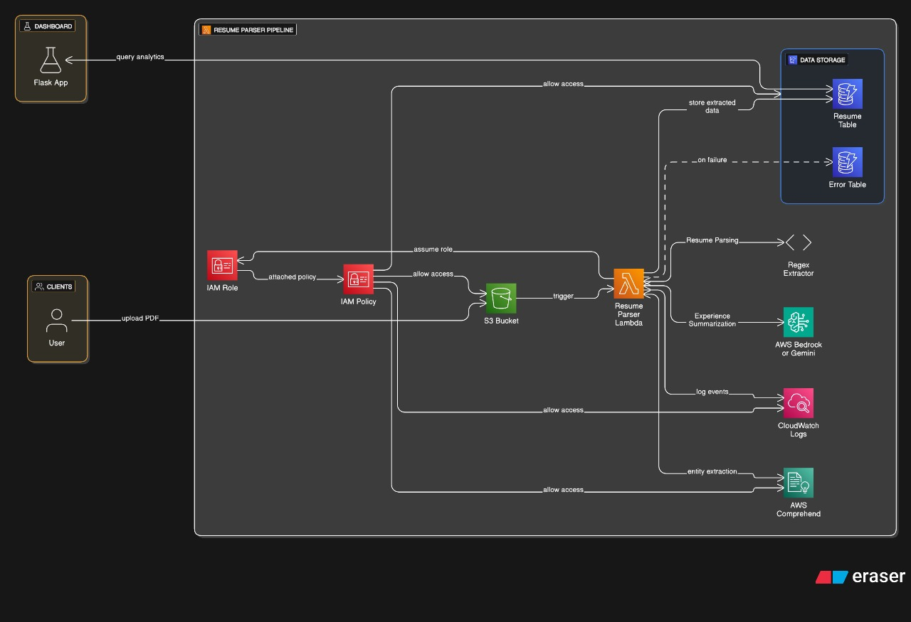

# 📄 Resume Parser and Skill Extractor

## 🔍 Overview

This project automates the parsing of resumes and extracts relevant skills using AWS Lambda and Python. When a PDF resume is uploaded to an S3 bucket, it triggers a workflow that extracts text, identifies skills using NLP, and creates a structured candidate profile. The final output is visualized through an admin dashboard.

---

## ⚙️ Technologies Used

- **Programming:** Python
- **Cloud Services:** AWS S3, AWS Lambda, (optionally DynamoDB, AWS Comprehend)
- **Libraries:** PyMuPDF, pdfminer.six, spaCy, Boto3
- **Dashboard:** Flask (Optional UI for admin reporting)
- **Formats:** JSON, CSV

---

## ⚙️ System Architecture



---

## 👥 Team Responsibilities

### 🧑‍💻 Member 1: Resume Upload & S3 Integration

<!-- **Files:**

- `upload_module/upload_form.html`
- `upload_module/s3_uploader.py` -->

**Tasks:**

- Create HTML form for resume uploads.
- Upload resumes to S3 and validate file type (PDF only).
- Handle file metadata and upload status.

---

### 🧑‍💻 Member 2: PDF Parsing & Text Extraction

<!-- **Files:**

- `parsing_module/lambda_function.py`
- `parsing_module/pdf_extractor.py`
- `parsing_module/utils.py`

**Tasks:** -->

- Write Lambda function triggered by new uploads.
- Extract text from PDF using PyMuPDF or pdfminer.
- Clean and normalize extracted content.
- Log any errors during processing.

---

### 🧑‍💻 Member 3: Skill Extraction & Classification

<!-- **Files:**

- `skill_extraction/lambda_function.py`
- `skill_extraction/skill_extractor.py`
- `skill_extraction/skill_keywords.json`
- `skill_extraction/classification.py`

**Tasks:** -->

- Identify technical/non-technical skills using regex or NLP.
- Use spaCy or AWS Comprehend (optional) for named entity recognition.
- Classify skills (Programming, Tools, Soft Skills).
- Return structured JSON with name and skills.

---

### 🧑‍💻 Member 4: Candidate Profile Generation

<!-- **Files:**

- `profile_generator/profile_builder.py`
- `profile_generator/id_generator.py`
- `profile_generator/anonymizer.py` -->

**Tasks:**

- Combine name, contact, and skills into a candidate profile.
- Generate CSV/JSON formats and store in S3.
- Assign unique candidate IDs.
- Ensure anonymization for testing data if required.

---

### 🧑‍💻 Member 5: Admin Dashboard & Reports

<!-- **Files:**

- `dashboard/app.py`
- `dashboard/templates/dashboard.html`
- `dashboard/static/style.css` -->

**Tasks:**

- Build Flask-based dashboard (optional).
- Display uploaded resumes and parsed profiles.
- Enable search, filtering, and report export (CSV).
- Track uploads, processing status, and errors.

---

## ✅ Getting Started

1. **Clone the repo:**

   ```bash
   git clone <repo-url>
   cd resume_parser_project
   ```

2. **Install dependencies:**

   ```bash
   pip install -r requirements.txt
   ```

---

## 🗂 Sample Output Format

```json
{
  "candidate_id": "R2025-001",
  "name": "Amit Sharma",
  "email": "amit@example.com",
  "skills": ["Python", "SQL", "Machine Learning"],
  "experience_summary": "3 years in data analysis and backend development"
}
```

---

## 📆 Milestones

| Week | Milestone               | Description                                  |
| ---- | ----------------------- | -------------------------------------------- |
| 1    | M1: Environment Setup   | AWS S3, Lambda permissions, Python setup     |
| 2    | M2: Upload & Trigger    | Resume upload form, Lambda trigger           |
| 3    | M3: Skill Extraction    | Build NLP/regex logic, extract skills        |
| 4    | M4: Profile Generation  | Create profile JSON/CSV outputs              |
| 5    | M5: Dashboard & Reports | Flask UI, download, filter, login (optional) |

---

## 💬 Collaboration Guidelines

- Follow module-wise ownership, but assist during integration.
- Commit meaningful messages and push frequently.
- Use test PDFs from `data/sample_resumes/` for validation.
